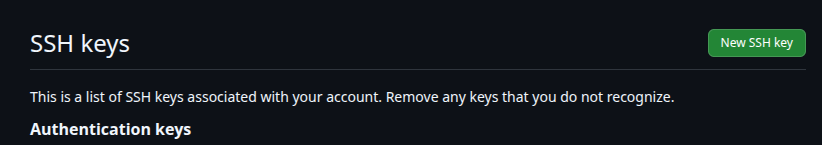
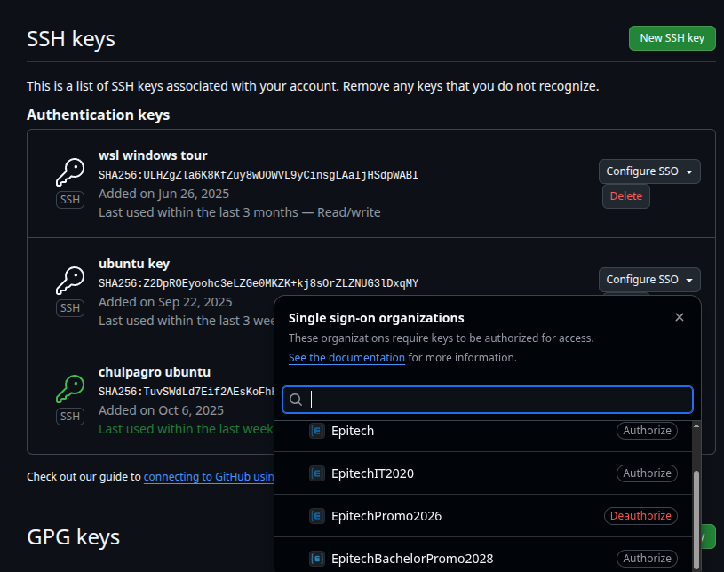

# Generate an SSH Key and Configure Git


## 1. Generate the SSH Key
```bash
ssh-keygen
```
Leave the passphrase empty if you want a key without a password (less secure but easier to use).
## 2. Start the SSH Agent and Add the Key
Linux / macOS only
```bash
eval "$(ssh-agent -s)"
ssh-add ~/.ssh/id_ed25519
```


## 3. Add the key to Github
```bash
cat ~/.ssh/id_ed25519.pub
```

### click on "add a new SSH key"


### then paste your key and save


### finally, authorize your organisations to use your key



## 4. Configure Git
Set your identity:
```bash
git config --global user.name "your username"
git config --global user.email "your.email@exemple.com"
```

To check your configuration:
```bash
git config --list
```


## 5. Best Practices
- Never share your private key.
- Use a passphrase for better security.
- Remove compromised keys from your Git account immediately.
- Keep a secure backup of ~/.ssh/id_ed25519.