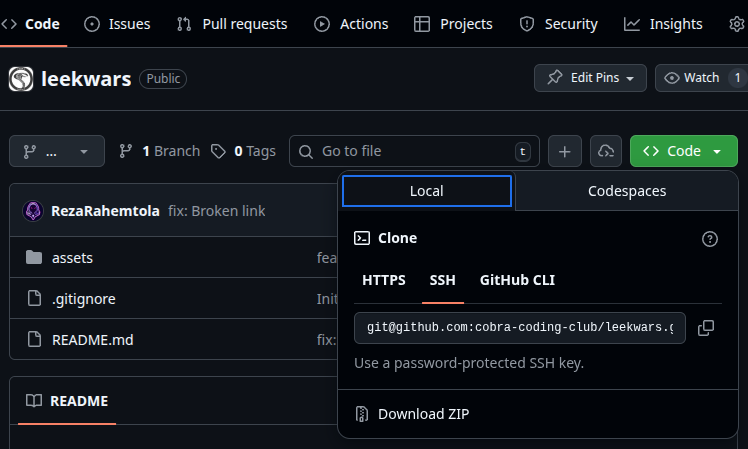

# Clone a Git Repository

## 1. What “Cloning” Means
Cloning creates a local copy of a remote repository (for example, from GitHub).  
It downloads all files, commit history, and branches into your computer.

---

## 2. Clone a Repository
Use ssh:

```bash
git clone git@github.com:cobra-coding-club/leekwars.git
```

Replace `cobra-coding-club/leekwars.git` with the actual path of the project.

---


## 3. Enter the Repository
```bash
cd leekwars
```

You are now inside the cloned project. Git will track all your operations in this directory.

---

## 4. Keep the Repository Up to Date
To download new changes made by others:
```bash
git pull
```

---

## 5. Summary
1. Copy the SSH or HTTPS link from GitHub.
2. Run `git clone <repo_url>`.
3. Enter the directory with `cd`.
4. Use `git pull` to stay up to date.

> Use SSH for a more secure and convenient setup.